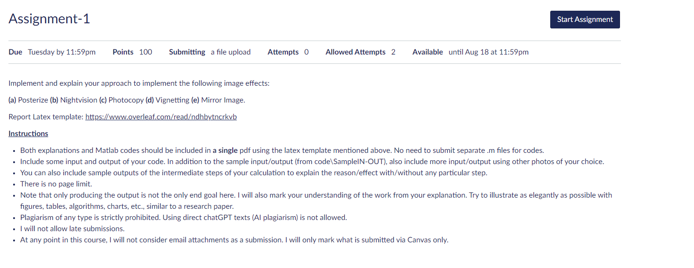

# Assignment 1: Image Effects Implementation

Welcome to Assignment 1 of the Digital Image Processing course at North South University! In this assignment, we dive into the world of image effects, bringing your images to life with fascinating transformations.

## What's Inside?

- `base code/`: The heart of your transformations, where MATLAB magic happens.
  - `input/`: Your image playground, filled with images to be transformed.
  - `output/`: The gallery of your masterpiece transformations.
  - `sampleIN-OUT/`: Your compass - sample input and expected output for guidance.

## Transformations Unleashed

Prepare to be amazed! We've unleashed an array of image effects to mesmerize you:
1. **Posterization**: Adding a touch of pop-art style to your images.
2. **Nightvision**: See the world through the eyes of night vision technology.
3. **Photocopy**: Copying images like a photocopier, but with a twist.
4. **Vignetting**: Embrace the dramatic spotlight effect in your images.
5. **Mirror Image**: Reflect and multiply your images in a mirror realm.

## Get Started

1. Clone or download this repository to your local machine.
2. Explore the `base_code/` directory and witness the code magic.
3. Execute MATLAB scripts to see transformations unfold before your eyes.
4. Witness the output images appear in the `output/` gallery.

## See It in Action: Before & After ✨

Witness the enchantment unfold as we present before-and-after images showcasing our magical powers:

### Posterization: Pop-Art Penguin 🐧🎨
From a plain penguin to a pop-art sensation!

### Nightvision: Penguin of the Night 🌃🦉
A penguin's nocturnal adventure in stunning night vision.

### Photocopy: Quirky Copy Penguin 🐧📄
Our penguin friend becomes a quirky copy machine masterpiece.

### Vignetting: Penguin in the Spotlight 🎭🌟
The spotlight is on as our penguin takes center stage.

### Mirror Image: Penguin's Reflections 🐧🪞
An introspective penguin gazes at its mirrored self.

### The Grand Finale 🎉

Congratulations! You've witnessed the wonders of the Image Wizardry show. But the real magic happens when you dive into the code and bring your own images to life. Feel free to explore and create your own image masterpieces!

## Validate Your Skills

Want to test your skills? We've provided sample input images and their expected outputs in the `sampleIN-OUT/` directory. Compare your creations with these golden standards.

## Dive Deeper

For an in-depth exploration, check out the detailed [assignment report](assignment_report.pdf). Uncover insights, code snippets, and visualizations that take you behind the scenes.

## Questions or Applause? 🎩👏

If you have any questions or wish to applaud the image wizard, don't hesitate to reach out to us. Happy image enchanting!

---

*Note: Image credits to [Unsplash](https://unsplash.com) for the adorable penguin images and to [Pikisuperstar](https://www.freepik.com/pikisuperstar) for the wizard illustration.*

